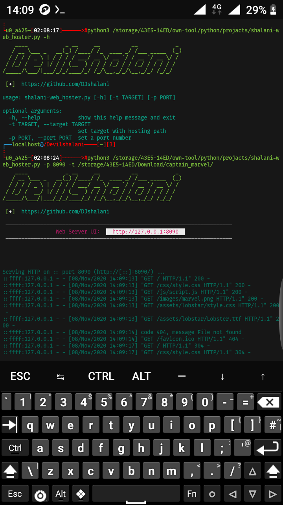

# sh_web-hoster

if python shalani_web-hoster.py 

copy this script

# white devil @ devilshalani python3 web hoster projact
import os
import argparse

def shalani_banner():
  print("    ____            _ __     __          __            _ ")
  print("   / __ \___ _   __(_) /____/ /_  ____ _/ /___ _____  (_)")
  print("  / / / / _ \ | / / / / ___/ __ \/ __ `/ / __ `/ __ \/ / ")
  print(" / /_/ /  __/ |/ / / (__  ) / / / /_/ / / /_/ / / / / /  ")
  print("/_____/\___/|___/_/_/____/_/ /_/\__,_/_/\__,_/_/ /_/_/   ")
  print('\n\033[01;32;40m [\033[01;37;40m+\033[01;32;40m] \033[01;36;40m https://github.com/DJshalani\n')
  
  
def shalani_print(port):
  print('\033[2;37;40m ––––––––––––––––––––––––––––––––––––––––––––––––––––––––––––––––––––––––')
  print('\033[1;35;40m                 Web Server UI:  \033[0;31;47m  http://127.0.0.1:' + port + '  ')
  print('\033[2;37;40m ––––––––––––––––––––––––––––––––––––––––––––––––––––––––––––––––––––––––                                                                                                                                                                                                                                                                                                               \033[01;36;40m')

def shalani_check(port, target):
  if target == None:
    shalani_print(port)
    os.system('python3 -m http.server ' + port)
  else:
    shalani_print(port)
    os.system('python3 -m http.server --directory ' + target + ' ' + port)

def shalani_options():
  parser = argparse.ArgumentParser()
  parser.add_argument('-t', '--target', dest="target", help="set target with hosting path")
  parser.add_argument('-p', '--port', dest="port", help="set a port number")
  options = parser.parse_args()
  return options

def shalani_main():
  try:
    target = shalani_options().target
    port = shalani_options().port
    if port == None:
      port = '8080'
      shalani_check(port, target)
    else:
      shalani_check(port, target)
  except KeyboardInterrupt:
    print('\nThanks For Using My Tool')
    print('\nThe Tool Is Exited')
      
shalani_banner()
shalani_main()

